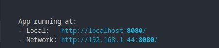

npm 
=============

npm run serve
--------------------

Ejecuta el script en la sección scripts - serve de package.json

.. code-block:: json

    "scripts": {
        "serve": "vue-cli-service serve",
        "build": "vue-cli-service build",
        "lint": "vue-cli-service lint"
    }

El resultado es el siguiente:

**Errores:**

* Con la versión **node 18** en adelante es necesario agregar en la sección scripts serve lo siguiente:

.. code-block:: shell

    NODE_OPTIONS=--openssl-legacy-provider

Y debería quedar de la siguiente manera:

.. code-block:: json

    "scripts": {
        "serve": "NODE_OPTIONS=--openssl-legacy-provider vue-cli-service serve",
        "build": "vue-cli-service build",
        "lint": "vue-cli-service lint"
    }