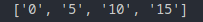

listas
================

Compresión de listas
----------------------------

Ejemplo:

Obtener una lista de aquellos números entre 0 y 20 que sean múltiplos de 5

.. code-block:: python

    lista = [str(num) for num in range(20) if num % 5 == 0 ]
    print(list)

Resultado:

Explicación:

1. Se itera con el loop for *for num in range(20)*
2. Se evalúa si se cumple la condición *if num % 5 == 0*
3. Si la condición se cumple el elemento el elemento iterado se considera como nuevo elemento de la lista y se le aplica un cast *str(sum)*

