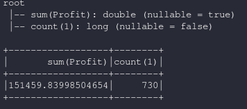

dataframe.agg
=============================

.. py:function:: df.agg(*exprs)

    Agregación sobre el Dataframe completo sin grupos, es un alias de *dataframe.groupBy().agg()*

    Parámetros:
        *exprs*: dict, pares de {campo:funcion de agregacion}        

Ejemplos:

* Creamos el dataset base para los ejemplos en base al archivo csv https://www.kaggle.com/anuvagoyal/sales-store-product-details

.. code-block:: python

    from pyspark.sql import SparkSession
    spark = SparkSession.builder.appName('spark-fast').getOrCreate()
    from pyspark.sql.types import *

    df = spark.read.csv("./datasets/Salesstore.csv", quote='"', scape='"', sep=",", header=True)
    df = df.withColumn("Profit",df["Profit"].cast(FloatType()))

agg simple
------------

.. code-block:: python

    df = df.agg({"Profit":"sum","*":"count"})
    df.show()

