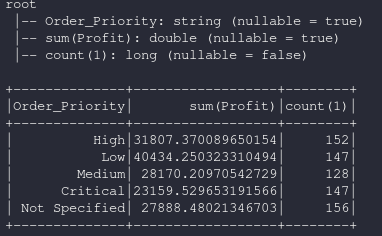
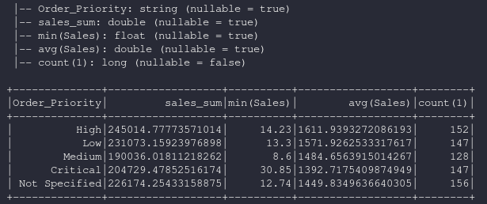

dataframe.groupBy
===============================

.. py:function:: df.groupBy(*cols)

    Agrupa el dataframe usando las columnas especificadas, para que podamos ejecutar la agregación sobre ellas. Ver **GroupedData** para todas las funciones de agregaciones disponibles.

    **Funciones de Agregación**
    https://spark.apache.org/docs/latest/api/python/reference/api/pyspark.sql.GroupedData.html#pyspark.sql.GroupedData

    Parámetros:
        :cols: list, string or column

        Columnas a agrupar. Cada elemento debería ser un nombre de columna (string) o una expresión (Column)

**Ejemplos:**

    * Archivo csv para los ejemplos https://www.kaggle.com/anuvagoyal/sales-store-product-details    

.. code-block:: python
    
    from pyspark.sql import SparkSession, dataframe
    spark = SparkSession.builder.appName('data_processing').getOrCreate()
    from pyspark.sql.types import *

    df = spark.read.csv("./datasets/Salesstore.csv", quote='"', escape='"', sep=",", header=True)
    df = df.withColumn("Profit",df["Profit"].cast(FloatType()))
    df = df.withColumn("Sales",df["Sales"].cast(FloatType()))

Usando dataframe.agg como diccionario
^^^^^^^^^^^^^^^^^^^^^^^^^^^^^^^^^^^^^^^

.. important::
    Si se usa como dict, solo admite una función de agregación por columna

.. code-block:: python
    
    df_agg = df.groupBy("Order_Priority").agg({"Sales":"sum","Profit":"max","*":"count"})
    df_agg.printSchema()
    df_agg.show()

Usando dataframe.agg con funciones
^^^^^^^^^^^^^^^^^^^^^^^^^^^^^^^^^^^^^^^

.. code-block:: python

    #Importante!
    #* cuando se usa agg y con funciones de agregación si que permite mas de una función por campo
    df_agg_func = df.groupBy("Order_Priority").agg(f.sum("Sales").alias("sales_sum"), f.min("Sales"),f.mean("Sales"),f.count("*"))
    df_agg_func.printSchema()
    df_agg_func.show()

