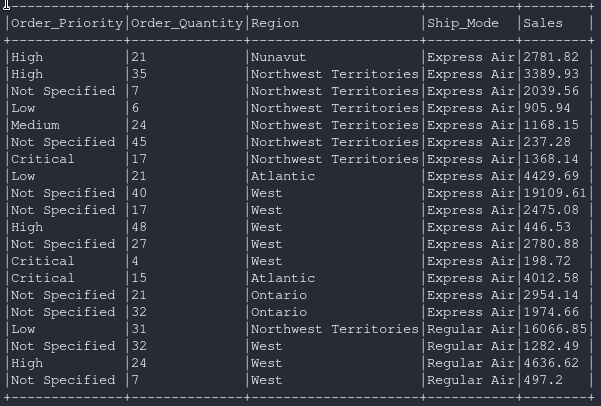
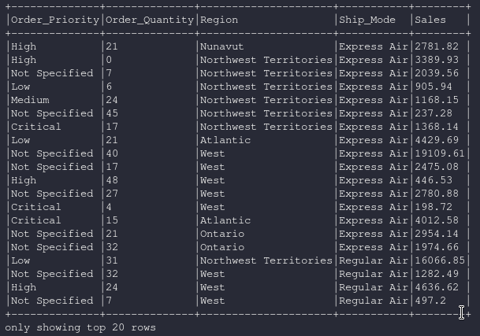
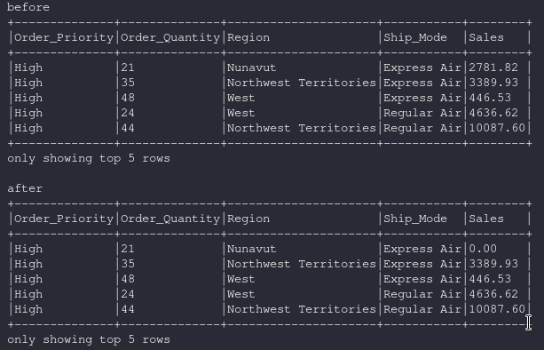
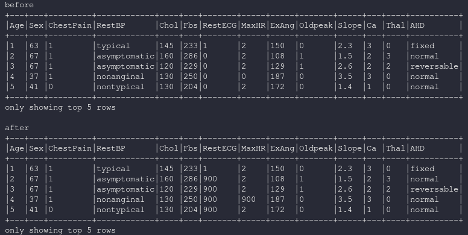

dataframe.replace
====================

.. py:function:: dataframe.replace(to_replace,value,subset)

    Parámetros:

        :to_replace: bool, int, float, string, list or dcit

            Valor a ser reemplazado. Si el valor es un dict, entonces **value** es ignorado o puede ser omitido, y **to_replace** deberia ser un mapeo entre un valor y un reemplazo

        :value: bool, int, float, string or None, optional

            El valor de reemplazo

        :subset: list de columnas, optional

            Lista de columnas a las cuales aplicar el reemplazo

Ejemplos
------------

Creamos el dataset para los ejemplos

.. code-block:: python

    from pyspark.sql import SparkSession
    spark = SparkSession.builder.appName('spark-fast').getOrCreate()
    from pyspark.sql.types import *
    import pyspark.sql.functions as F

    df = spark.read.csv("./datasets/Salesstore.csv", sep=",", header=True)
    df = df.select("Order_Priority","Order_Quantity","Region","Ship_Mode","Sales")
    df.show(truncate=False)

dataframe.replace(to_replace=str, value=str)
^^^^^^^^^^^^^^^^^^^^^^^^^^^^^^^^^^^^^^^^^^^^

.. code-block:: python

    df = df.replace("35","0")
    df.show(truncate=False)

dataframe.replace(to_replace=float, value=float)
^^^^^^^^^^^^^^^^^^^^^^^^^^^^^^^^^^^^^^^^^^^^^^^^^

.. warning::

    En el código la columna "Sales" se convierte a un decimal(15,2) para que la sustitucion en decimales funcione, cuanto el tipo de dato es **FloatType** no funciona.

.. code-block:: python
    
    df = df.withColumn("Sales",df.Sales.cast(DecimalType(15,2)))

    df = df.filter("Order_Priority = 'High'")
    df = df.replace(to_replace=2781.82,value=0.00)
    df.show(n=5, truncate=False)

dataframe.replace(to_replace=int, value=int, subset=[str, str])
^^^^^^^^^^^^^^^^^^^^^^^^^^^^^^^^^^^^^^^^^^^^^^^^^^^^^^^^^^^^^^^^

Para este ejemplo usamos otro csv que es:

    https://www.kaggle.com/meetnagadia/heart-disease

.. code-block:: python

    df = spark.read.csv("./datasets/heart_disease.csv", escape='"', sep=",", header=True)
    df = df.withColumn("RestECG", df.RestECG.cast(IntegerType()))
    df = df.withColumn("MaxHR", df.MaxHR.cast(IntegerType()))
        
    #Aplica solo a las columnas que se encuentran dentro de subset
    df = df.replace(to_replace=0,value=900,subset=["RestECG","MaxHR"])   
    df.show(n=5,truncate=False)

