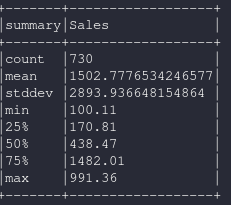

dataframe.summary
===============================

Computa estadisticas específicas para columnas númericas y strings. las estadisticas disponibles son: count, mean, stddev, min, max, percentiles aproximados arbitrarios especificados como %

.. py:function:: df.summary()

Ejemplos:
----------

Creamos el dataset base para los ejemplos en base al archivo csv https://www.kaggle.com/anuvagoyal/sales-store-product-details

.. code-block:: python

    from pyspark.sql import SparkSession
    spark = SparkSession.builder.appName('spark-fast').getOrCreate()
    from pyspark.sql.types import *

    df = spark.read.csv("./datasets/Salesstore.csv", quote="", escape='"', sep=",", header=True)
    df = df.select(df["Sales"])
    df.summary().show(truncate=False)

**Resultado**

    